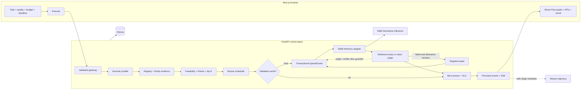
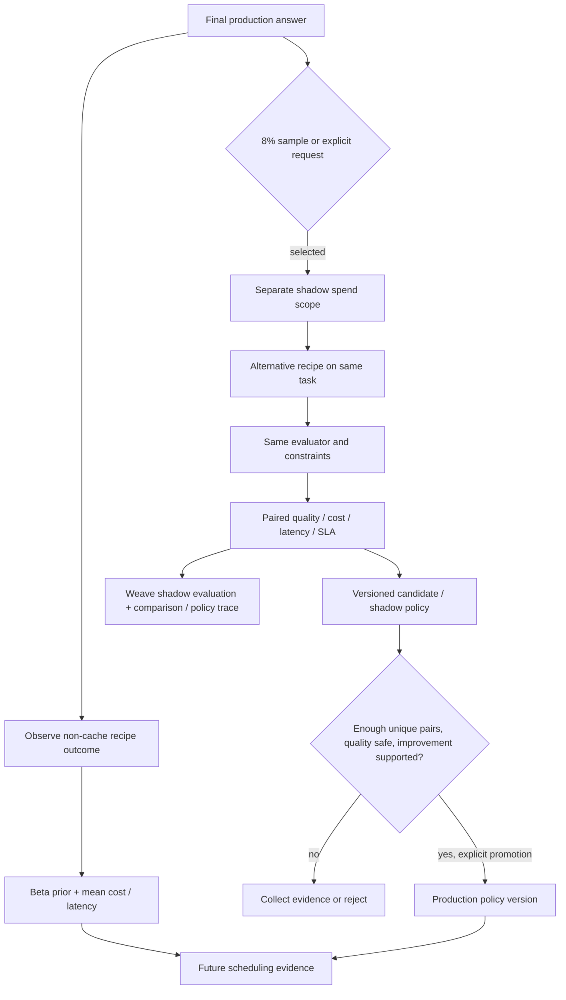
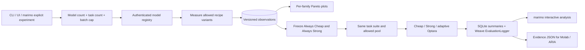

# Optara architecture

**Constraint-Aware LLM Execution & Evaluation Platform**

The backend owns execution state and all paid actions. The browser visualizes persisted facts; elapsed-time animation is the only client-generated execution measurement. SQLite transactions serialize spend reservations and event sequence numbers. Weave is the remote evidence layer; a Weave or MCP outage does not replace local control logic.

Shadow never updates production output or its metrics. Only its `shadow_result` association and subsequent event history are added. Comparison tracing is a separate root linked by run IDs because serving has already finished. Historical policy versions remain inspectable after replacement.

## Module boundaries

| Layer | Owner | Contract |
|---|---|---|
| Gateway / jobs | `backend/app/main.py` | Typed requests, 2 workers, read APIs, SSE replay, interrupted-job recovery |
| Execution | `controller.py` | Recipe → guarded calls → evaluations → bounded repair → immutable serving metrics |
| Scheduling | `scheduler.py`, `pareto.py`, `history.py` | Empirical family/version estimates, uncertainty, feasible top K |
| Safety | `spend_guard.py`, `safe_python.py`, `cache.py` | Atomic reservations, bounded AST execution, confidence/version/freshness cache rules |
| Learning | `shadow.py`, `policy.py` | Distinct paired evidence, configurable gates, explicit version promotion |
| Persistence | `persistence.py` | SQLite WAL, documents, ordered events, cumulative spend |
| Integrations | `backend/integrations/` | W&B inference, Weave Calls/evaluations, MCP history, disabled optional adapters |
| Experiments | `benchmarks/`, `experiment_lab/` | Shared fixed suite, fair pool/constraints, interactive evidence analysis |
| MCP | `backend/mcp_server/server.py` | Small stdio interface to the existing HTTP backend; no second worker/database owner |

## Invariants and failure behavior

All model calls—including judging, verification, repair, calibration, and shadow—pass through one guard. Reservations are made before a network request; actual known cost settles the reservation. Unknown usage retains its reservation. Time limits use a monotonic clock. No inference occurs at import, startup, page render, or status polling.

Run IDs, modes, recipe versions, evaluator versions, policy versions, and shadow associations make evidence attributable. Simulation fixtures never call sponsor services or feed live estimates. A newer evaluator cannot reinterpret old observations as current evidence; past reports remain immutable.

The browser consumes SSE during execution and polls snapshot history afterward so late shadow/learning events remain visible. Reconnects use event sequence IDs; loading a running saved task does not await a never-ending response body. Failures surface an explicit blocked/miss state. Restart recovery marks incomplete jobs interrupted rather than silently replaying paid calls.

Secret-bearing settings are never serialized into traces. Credential lookup uses environment/settings or the standard W&B credential file. Redaction applies to task/output paths and trace postprocessing. Inference failures expose a bounded diagnostic, not raw provider response headers or authorization data.

## Existing runtime boundary

The deployment package preserves this architecture in one long-running Docker service: `scripts/serve.py` starts FastAPI on internal port 8000, waits for its health check, then exposes production Next.js on the host's `PORT`. Same-origin `/api` rewrites carry HTTP and SSE to FastAPI. Railway's persistent volume is intended to mount at `/data`, with `OPTARA_DB_PATH=/data/optara.db`; the saved spend ledger survives deployments. W&B credentials belong in the hosting secret environment, never the image or repository. `RAILWAY_PUBLIC_DOMAIN` supplies the allowed browser origin unless explicitly configured. The existing public app and its persisted real execution were verified. The final pass makes no hosting changes; the active demo database is `/data/optara-demo.db`.

This remains a production-oriented single-user demonstrator, not a distributed or multi-tenant service. The portfolio release changes the local UI and documentation only; the existing public host retains its previously deployed UI.

## Execution contracts

- **TaskProfile**: deterministic task-family, difficulty, cacheability and evaluator selection hints; no paid profiling call.
- **Recipe**: versioned model ID, reasoning configuration, output allowance, verifier and bounded repair settings.
- **Scheduler**: family/version evidence, feasibility checks, Pareto filtering and conservative quality estimates. Saved candidates and rejection reasons explain the choice; priors remain distinct from observations.
- **W&B Inference**: typed adapter with actual token accounting and guarded provider calls.
- **Evaluator**: exact/reference, JSON schema/field checks or supported Python behavioral tests; otherwise a labelled rubric estimate. Unsupported evaluation is a limitation, not certified incorrectness.
- **Repair**: failed checks inform a bounded retry; retain the best evaluated answer if further work is blocked or worse.
- **Cache**: confidence, passing quality, freshness, mode, prompt semantics and recipe/evaluator versions control reuse.
- **Persistence / Weave**: SQLite owns runs and events; traces correlate by stored IDs and URLs. Trace failure does not destroy the local result.
- **Evaluation evidence**: current-version observations feed recipe statistics; historical reports remain immutable. Offline pytest fixtures exercise evaluator and repair regressions without live calls.

## Product surfaces

Execute presents constraints, selected configuration, expected candidate metrics, actual result, evaluation and execution evidence before the compact graph. Runs reopens records through GET endpoints; it never submits inference. Evaluations combines measured family-level quality/cost/latency Pareto analysis, recipe performance, evaluator coverage and completed benchmark reports. Shadow, calibration and explicit policy actions remain in a collapsed Advanced Experiments section.

## Scientific analysis surface

Execute shows current execution decisions. `experiment_lab/optara_lab.py` explains their empirical basis through reactive source/namespace/family filters, overview cards, Pareto charts, recorded candidate decisions, paired shadow deltas, policy gates, and the latest benchmark. The lab reads a safe versioned snapshot, an uploaded export, or the local API. It never promotes policies or makes paid calls on load. Molab uses the same portable notebook and public-safe evidence, with a rendered session for GitHub previews; it is not a second serving backend.

## Experimental analysis boundary

Experimental W&B ARIA analysis was used to inspect accumulated evaluation evidence. ARIA is not part of the production request path and does not directly modify production policy. A callable programmatic integration is not verified.
