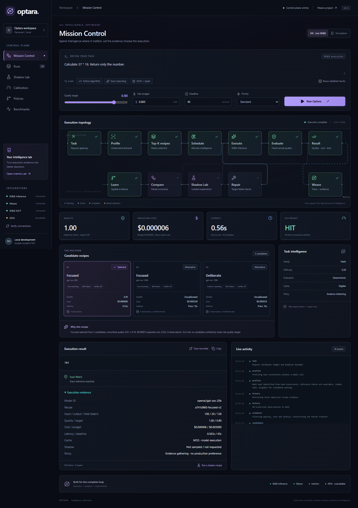
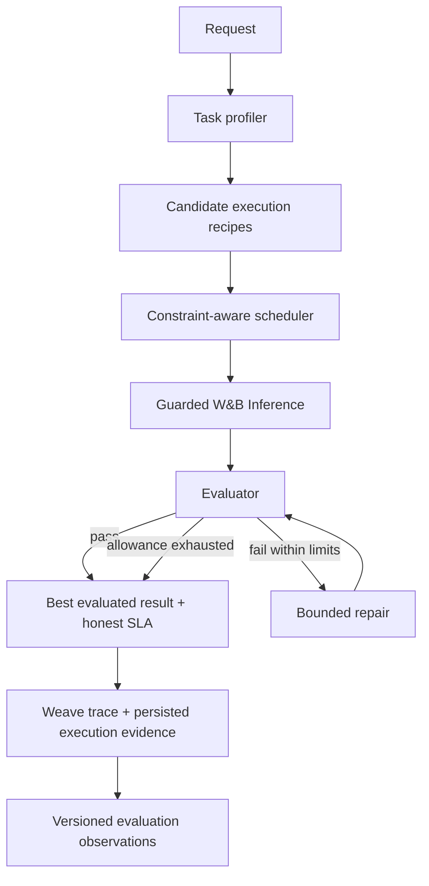

# Optara

**Constraint-Aware LLM Execution & Evaluation Platform**

Optara evaluates LLM execution strategies against quality, cost, and latency constraints, executes the selected strategy, validates the response, performs bounded repair when necessary, and records complete execution telemetry for analysis and regression testing.

## Demo

**Execute** explains the selected recipe and its measured result. **Runs** reopens persisted executions without a model call. **Evaluations** compares measured recipe performance and exposes the evidence behind tradeoffs.

[60–90 second saved-run walkthrough](DEMO.md) · [Reproducible Evaluation Notebook](https://molab.marimo.io/github/rohit16111999/optara/blob/main/experiment_lab/optara_lab.py) · [Weave](https://wandb.ai/models-student1155/optara/weave)

The [existing public demo](https://optara-production.up.railway.app) was verified on September 13, 2026. It retains the earlier Mission Control UI: this portfolio release is in source and runs locally; it was **not redeployed**. Molab provides a public rendered preview; an interactive cloud session may require sign-in. See [MOLAB.md](MOLAB.md).



The existing screenshot documents the earlier UI. The current local navigation is Execute / Runs / Evaluations.

## Problem

LLM applications must balance quality, cost, latency and reliability. Different requests justify different execution configurations. Model price alone misses judging, verification, repair and failure costs; Optara measures the complete recipe rather than assuming a model name determines its performance.

## How it works



## Key features

- Recipe scheduling across model, reasoning, token allowance, verification and repair settings.
- Expected candidate metrics and actual completed-run metrics presented separately.
- Exact-reference, schema and supported Python behavioral checks; open-ended answers use labelled rubric estimates.
- Bounded repair, atomic spend reservations, deadlines and call limits.
- Actual token usage, calculated list-rate cost, serving latency and quality/budget/deadline SLA.
- Validated cache, persistent run history, SSE replay and remotely verified Weave traces.
- Offline evaluator regression tests and reproducible marimo / Molab evidence analysis.
- Independent shadow evidence and explicit policy gates under Advanced Experiments.

## Stack

Python, FastAPI, Pydantic, HTTPX and SQLite; Next.js, React, TypeScript and Tailwind; React Flow, Motion and Recharts; W&B Serverless Inference, Weave and MCP; marimo, pandas and Altair. Pytest and Playwright provide automated validation.

## Evaluation

The existing local LIVE evidence, checked September 14, 2026, contains **64 current-evaluator observations, 7 observed recipes, 8 uncached production executions, 6 completed shadow pairs and 2 policy versions**. These are different scopes, not additive counts. Authentication-only observations are excluded. The UI computes values from its loaded namespace rather than hardcoding these counts.

The saved local demo run `9dbae5a2-aec1-4ff3-a35c-9282e6cf515f` returned **703**, quality **1.00**, **128 tokens**, calculated cost **$0.00000584**, serving latency **0.563s**, and **SLA HIT**. It used `openai/gpt-oss-20b`, Focused v2, and an objective exact-match evaluator. [Recorded Weave trace](https://wandb.ai/models-student1155/optara/r/call/01a098ad-631e-76a8-af46-c4f5b4f347e3).

The existing 18-execution benchmark achieved mean quality 0.991667 and 100% SLA for all three strategies. Mean costs were Always Cheap $0.0000334583, Always Strong $0.0000266867 and Optara $0.0000379933: **Optara did not save cost in this sample**. Five paired math shadows had equal quality but were more expensive and slower, so promotion was blocked.

This small evaluation corpus demonstrates execution behavior and trade-off analysis; it does not establish universal model or cost superiority. Costs are actual usage multiplied by documented uncached list rates, not billing receipts. Historical evidence and its limitations are retained in [VALIDATION.md](VALIDATION.md).

## Running locally

Tested with Windows, Python 3.12 and Node 22. The setup uses uv and the existing lockfiles.

```powershell
.\setup.ps1
.\start.ps1
```

Open http://127.0.0.1:3000; API docs: http://127.0.0.1:8000/docs. Startup and browsing do not invoke models. Use **Runs** to inspect existing local records; a fresh clone does not include the private runtime database. The notebook includes a public-safe evidence snapshot.

For a production frontend build:

```powershell
npm --prefix frontend run build
.\start.ps1 -Production
```

For macOS/Linux: `uv sync --frozen --python 3.12`, `npm ci --prefix frontend`, then `node scripts/dev.mjs`. Windows is the validated environment. To open the local notebook, run `.\lab.ps1`.

Live execution requires W&B credentials. `.\scripts\login.ps1` uses hidden terminal input; never put a key in chat or Git. `.env.example` documents variable names. Live requests are explicit and can incur cost; use Simulation for offline exploration. No paid verification command is part of startup or this demo.

## Tests

```powershell
.venv\Scripts\python.exe -m pytest -q backend/tests -m "not live"
npm --prefix frontend run typecheck
npm --prefix frontend run build
```

With both services running, the targeted saved-run browser check is:

```powershell
npm --prefix frontend test -- --grep "saved real run portfolio"
```

That check uses the saved local demo ID above, fails if it is absent, and blocks all mutating API requests. It never creates a substitute live run.

## Regression evaluations

Reuse the existing evaluator/controller regression tests; no second evaluation subsystem is needed:

```powershell
.venv\Scripts\python.exe -m pytest -q backend/tests/test_control_plane.py -k "exact_evaluator or structural_json or json_reference or supported_python or targeted_repair_bounded"
```

These offline fixtures check exact answers, JSON semantics/structure, Python behavioral tests and bounded repair, with a nonzero exit on failure. They are regression protection for supported behavior, not a live-model quality benchmark. Historical benchmark/calibration runners remain available but are not part of this workflow.

## Architecture

See [ARCHITECTURE.md](ARCHITECTURE.md) for contracts, invariants and failure behavior. W&B MCP provides history/development queries independently of serving; Optara's stdio MCP server is `python -m backend.mcp_server.server` and uses the existing HTTP backend. Its `optimize_task` tool can spend money when explicitly invoked.

Experimental W&B ARIA analysis was used to inspect accumulated evaluation evidence. ARIA is not part of the production request path and does not directly modify production policy. A callable programmatic integration is not verified.

## Limitations

- Small in-sample corpus; heuristic profiling and uncertainty estimates are not general guarantees.
- Open-ended quality depends on the judge; bounded Python tests do not certify arbitrary programs or asymptotic complexity.
- Single-user demonstrator with two worker slots, SQLite persistence and no multi-tenant authentication. It is production-oriented, not an enterprise-scale deployment.
- Pricing and model availability may change. Trace contents can include task/output data; use public-safe demo tasks.
- The public host retains the previous UI. Molab preview publication is distinct from a verified running cloud kernel.

## Future work

Held-out workload evaluation, calibrated uncertainty and authenticated multi-user controls.
